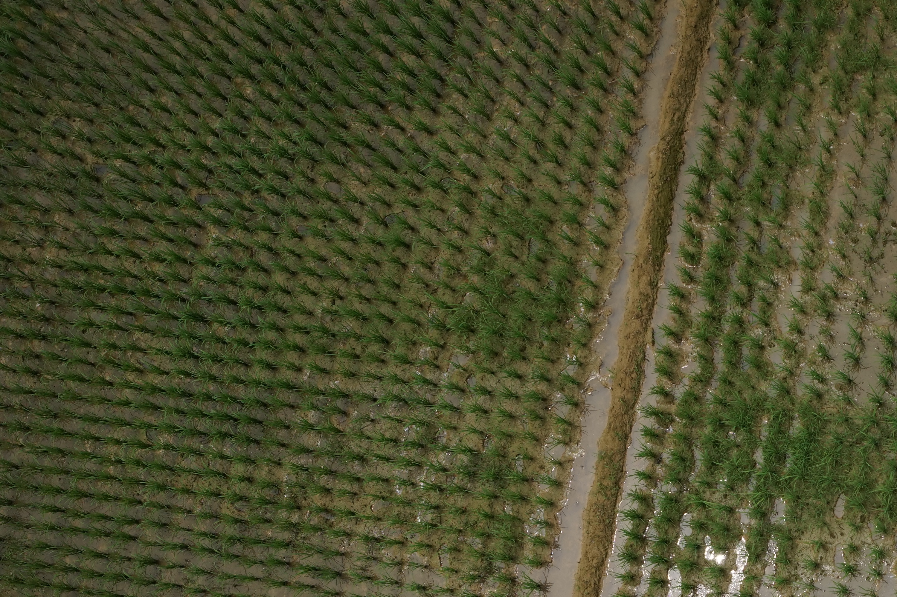
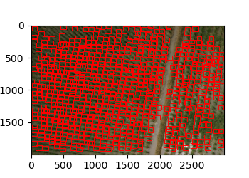
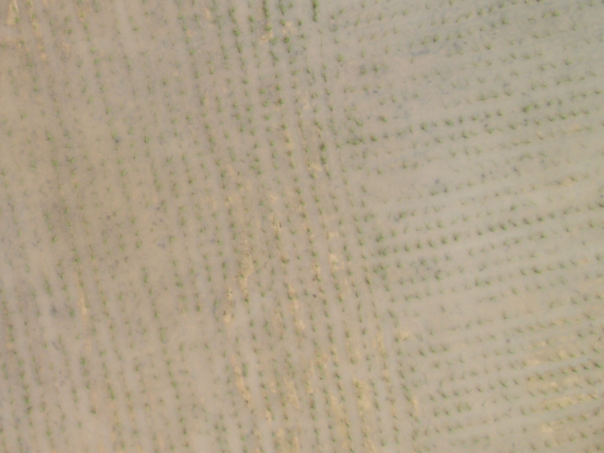
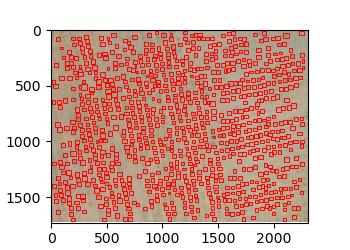

# Yolo_For_Crop_detection

Dataset (解壓縮到main) : https://drive.google.com/file/d/1xK0rd71wyaL-a2j2glBEfDiyp1NKE1b1/view?usp=sharing 

trained_weights (./save/attention_model_v2.pt) : 

detect : run -- ./train/detect_whole_img.py

### Result

